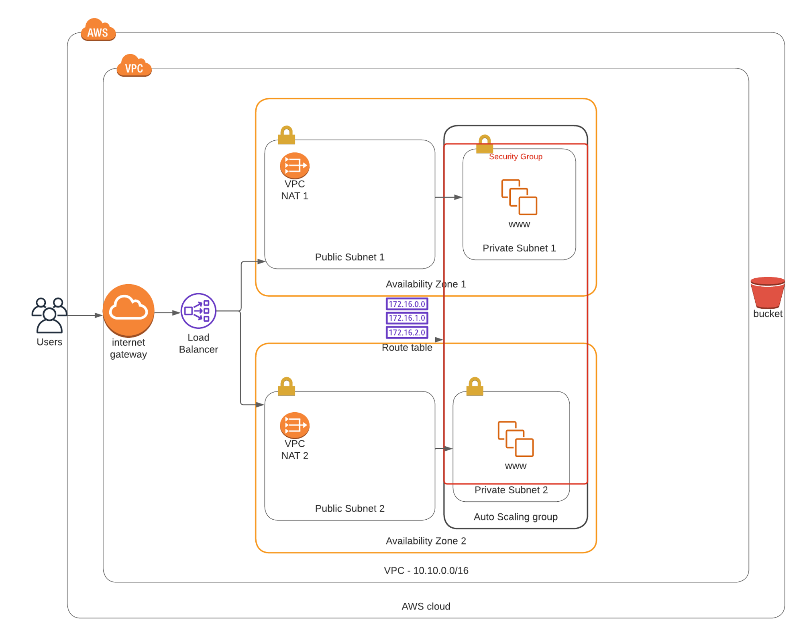

Terraform which is the leading(IAC) tool was used to build this infrastructure, The project describes installation of an apache webserver on an ec2 instances residing in the private subent of a vpc. a shell script that installs the apache webserver on an ubuntu ami is written as the userdata to install the apache webserver at launch of the instances. a Demo s3 bucket was also attached as a backend which could serve various purpose from static website hoisting, storage of files as well as backup of data from the ec2 instances.

